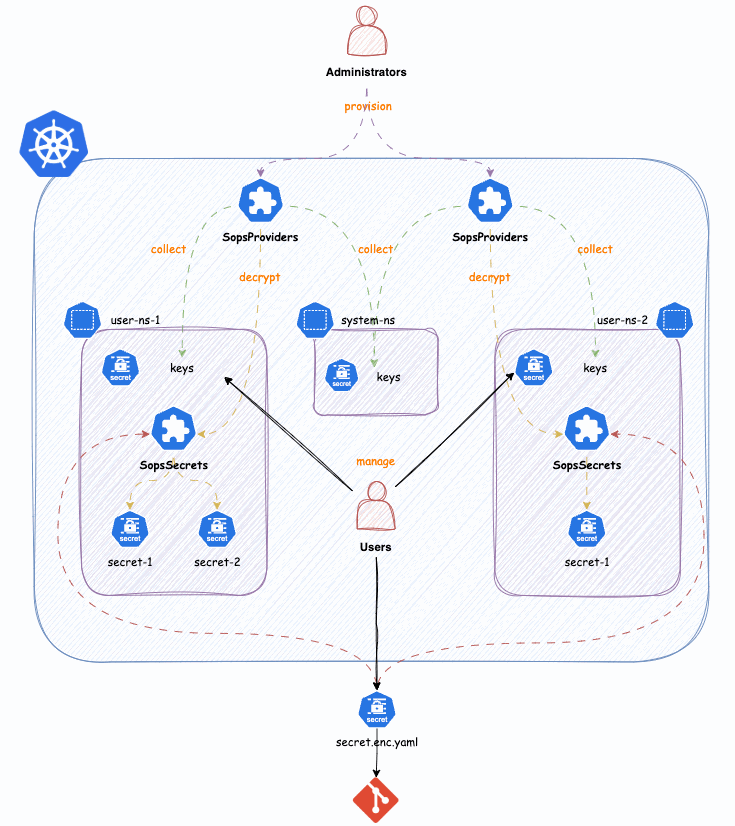

> [!IMPORTANT]
> Regarding the code, most of the SOPS implementation was taken from the [Flux kustomize-constroller](https://github.com/fluxcd/kustomize-controller/blob/main/internal/decryptor/decryptor.go) project. We have left the License-Header as-is, if further attribution is wished, please open an issue. We go the idea from the existing [sops-operator](https://github.com/isindir/sops-secrets-operator). However the implementation was not optimal for our use-cases, that's why we decided to release our own solution.

# SOPS-Operator ❤️

We have always loved how [Flux handles Secrets with SOPS](https://fluxcd.io/flux/guides/mozilla-sops/), it's such a seamless experience. However we have noticed, that it's kind of hard to actually distribute keys to users in a kubernetes native way. That's why we built this operator. It introduces [Providers](docs/usage.md#providers), which essentially match Kubernetes resources which represent Keys or access to KMS stores. On the Provides you also declare, which [Secrets](docs/usage.md#secrets) you want to encrypt with that provider. **Currently only works with PGP and AGE for n-secrets** That leaves open that, N-providers can load private keys for one Secret, in complex scenarios. Also we want to provide a general solution to decrypting secrets, not a solution which is dependent on a gitops engine.

## Concept

This Operators introduces the concept of [SopsProviders](./docs/usage.md#providers). `SopsProviders` are created by Cluster-Administrators and are essentially a connecting-piece for collecting private-keys and [`SopsSecrets`](./docs/usage.md#sopssecrets), which can use these keys for decryption.

With this option an Kubernetes users may manage their own keys and [`SopsSecrets`](./docs/usage.md#sopssecrets). The implementation of `SopsSecrets` allows them to be applied to the Kubernetes API with sops encryption-meta. The entire decryption happens within the cluster. So a `SopsSecret` is applied the way it's stored eg. in git.

## Documentation

See the [Documentation](docs/README.md) for more information on how to use this addon.

## Demo

Spin up a live demonstration of the addon on Killercoda:

- [https://killercoda.com/peakscale/course/solutions/multi-tenant-sops](https://killercoda.com/peakscale/course/solutions/multi-tenant-sops)

## Support

This addon is developed by the community. For enterprise support (production ready setup,tailor-made features) reach out to [Peak Scale](https://peakscale.ch/en/)

## License

Copyright 2024.

Licensed under the Apache License, Version 2.0 (the "License");
you may not use this file except in compliance with the License.
You may obtain a copy of the License at

    http://www.apache.org/licenses/LICENSE-2.0

Unless required by applicable law or agreed to in writing, software
distributed under the License is distributed on an "AS IS" BASIS,
WITHOUT WARRANTIES OR CONDITIONS OF ANY KIND, either express or implied.
See the License for the specific language governing permissions and
limitations under the License.

